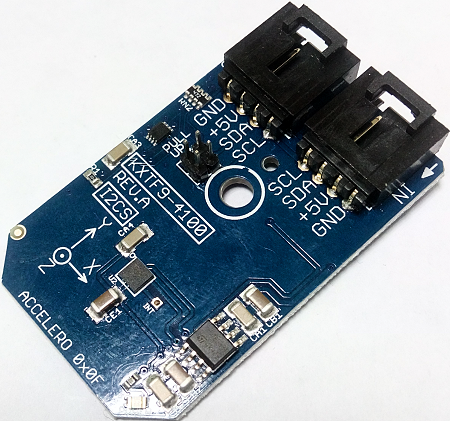

[](https://www.controleverything.com/products)
# KXTF9-4100
KXTF9-4100 3-Axis Accelerometer

The KXTF9-4100 device, provides digital acceleration for X, Y and Z axis.

This Device is available from ControlEverything.com [SKU: KXTF9-4100_I2CS]

https://www.controleverything.com/products

This Sample code can be used with Raspberry Pi, Arduino, Beaglebone Black and Onion Omega.

## Java
Download and install pi4j library on Raspberry pi. Steps to install pi4j are provided at:

http://pi4j.com/install.html

Download (or git pull) the code in pi.

Compile the java program.
```cpp
$> pi4j KXTF9_4100.java
```

Run the java program.
```cpp
$> pi4j KXTF9_4100
```

## Python
Download and install smbus library on Raspberry pi. Steps to install smbus are provided at:

https://pypi.python.org/pypi/smbus-cffi/0.5.1

Download (or git pull) the code in pi. Run the program.

```cpp
$> python KXTF9_4100.py
```

## Arduino
Download and install Arduino Software (IDE) on your machine. Steps to install Arduino are provided at:

https://www.arduino.cc/en/Main/Software

Download (or git pull) the code and double click the file to run the program.

Compile and upload the code on Arduino IDE and see the output on Serial Monitor.

## C

Download (or git pull) the code in Beaglebone Black.

Compile the c program.
```cpp
$>gcc KXTF9_4100.c -o KXTF9_4100
```
Run the c program.
```cpp
$>./KXTF9_4100
```

## Onion Omega

Get Started and setting up the Onion Omega according to steps provided at :

https://wiki.onion.io/Get-Started

To install the Python module, run the following commands:
```cpp
opkg update
```
```cpp
opkg install python-light pyOnionI2C
```

Download (or git pull) the code in Onion Omega. Run the program.

```cpp
$> python KXTF9_4100.py
```

#####The code output is raw value of acceleration in X, Y and Z Axis.
